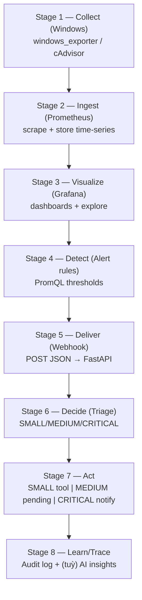

# Day 1 — Chốt phạm vi + kiến trúc + tiêu chí hoàn thành (làm rõ “cần học gì” và “làm gì”)

## 1) Mục tiêu của Day 1

Sau Day 1, bạn phải có một **bản thiết kế MVP rõ ràng** để 13 ngày sau chỉ việc “triển khai theo checklist”, bám đúng SRS (MVP) của dự án:

- Nhận **webhook** từ **Grafana Unified Alerting**
- **Triage** SMALL/MEDIUM/CRITICAL
- SMALL gọi **tool/script trong whitelist**
- MEDIUM tạo **pending** chờ duyệt
- CRITICAL **notify** (Telegram/Email/Discord)
- Ghi **audit** đầy đủ (input → decision → action → outcome)

### Tiến độ Day 1 (đã chốt/hoàn thành)

| Hạng mục | Trạng thái |
|---|---|
| Chốt metrics cốt lõi (Windows exporter) | ✅ |
| Chốt 3 alerts tối thiểu | ✅ |
| Chốt Tool/Script whitelist + allowlist/blocklist | ✅ |
| Chốt triage policy (rule-based fallback) | ✅ |
| Chốt đo SLA < 30s (`received_at`/`notified_at`/`processing_time_ms`) | ✅ |
| Chốt format `rag_context_refs` (URN) | ✅ |
| Chốt mapping Severity ↔ Tool (SMALL/MEDIUM/CRITICAL) | ✅ |
| Chốt format `execution_output` 1 dòng | ✅ |
| Chốt lưu `processing_time_ms` trong `audit_logs` | ✅ |
| Mermaid kiến trúc luồng + sơ đồ pipeline | ✅ |

---

## 2) Những thứ cần học trước (tối thiểu để làm được 14 ngày)

> Mục tiêu phần “học trước” là đủ hiểu để **ra quyết định đúng** (scope/kiến trúc) và **không bị kẹt** khi bắt đầu dựng stack ngày 2–6.

### 2.1 Monitoring & Observability (cốt lõi)

- **Bạn cần hiểu**
  - **Pull-based monitoring**: Prometheus *scrape* metrics từ exporter (khác với push).
  - **Metric vs Log vs Event**
    - Metric: số liệu theo thời gian (CPU, RAM…)
    - Log/Event: giải thích nguyên nhân (Windows Event Log…)
  - Khái niệm **target UP/DOWN**, labels, series.
- **Bạn cần làm được**
  - Đọc một dòng metrics dạng Prometheus.
  - Viết được PromQL cơ bản: `up`, `rate()`, `avg_over_time()`.
- **Tài liệu dự án nên đọc**
  - `Project skill/README.md` (luồng tổng quan)
  - `Project skill/SRS.md` phần phạm vi MVP + yêu cầu bảo mật

### 2.2 Grafana Alerting + Webhook (để nối vào backend)

- **Bạn cần hiểu**
  - Alert rule → Contact point → Notification (Webhook)
  - Payload webhook là **HTTP POST JSON** (đầu vào cho FastAPI).
- **Bạn cần làm được**
  - Giải thích được: “khi CPU > 90% 5 phút thì Grafana gửi POST đến endpoint nào”.
- **Tài liệu nên đọc**
  - `Project skill/ALERTING_RULES.md`
  - `Project skill/API_DOCS.md` (nếu đã có endpoint mẫu)

### 2.3 Windows monitoring (đường đi ngắn nhất)

- **Bạn cần hiểu**
  - Exporter là “cầu nối” giữa Windows và Prometheus.
  - Với Windows, hướng MVP nhanh nhất là **windows_exporter**.
- **Bạn cần quyết định sớm (trong Day 1)**
  - **Option A (khuyến nghị)**: dùng `windows_exporter` → Prometheus scrape.
  - **Option B**: tự viết agent gửi dữ liệu (dễ “lạc scope”).

### 2.4 Backend FastAPI (MVP ingestion webhook + audit)

- **Bạn cần hiểu**
  - FastAPI nhận POST JSON, validate bằng Pydantic, trả HTTP codes.
  - Audit log: tối thiểu lưu `alert_id`, `received_at`, `severity`, `action`, `result`.
- **Bạn cần làm được**
  - Vẽ model dữ liệu tối thiểu cho audit/pending (file JSONL hoặc SQLite).

### 2.5 Security “minimum” (để không bị hội đồng bắt lỗi)

Theo SRS/NFR:

- **Không cấp shell tự do cho AI**
- **Chỉ tool/script trong whitelist**
- Endpoint nhạy cảm có **xác thực tối thiểu** (API key)
- **Secrets không commit** (dùng `.env`)

Tài liệu nên đọc: `Project skill/SECURITY_AND_PRIVACY.md`.

---

## 3) Việc cần làm trong Day 1 (cụ thể theo checklist)

### 3.1 Chốt phạm vi MVP (đừng tham)

- **Chọn Metrics tối thiểu (5–8) cho Windows**
  - Để giám sát máy chủ Windows, Prometheus sử dụng **Windows exporter** (trước đây gọi là **WMI exporter**).
  - Bạn nên cấu hình thu thập **5–6 metrics cốt lõi** sau để vừa đủ bao quát hệ thống mà không bị nhiễu dữ liệu:
    - **CPU usage**: Mức sử dụng tổng thể của CPU.
    - **Memory usage**: Mức tiêu thụ RAM của hệ thống.
    - **Disk space / Disk I/O**: Dung lượng còn trống và tốc độ đọc/ghi của ổ cứng.
    - **Network interface performance**: Băng thông và tình trạng mạng truyền tải.
    - **Service states**: Trạng thái hoạt động của các dịch vụ (services) đang chạy trên Windows.
    - **Container Metrics (nếu chạy Docker trên Windows)**: Trạng thái, mức tiêu thụ CPU/RAM của các container thông qua **cAdvisor** hoặc tính năng giám sát Docker.
  - *(Lưu ý)* Windows exporter cũng có thể theo dõi thông số riêng của **.NET** như **.NET performance counters**, nhưng với **MVP** bạn có thể tạm bỏ qua nếu không có nhu cầu đặc thù.

- **Chọn Alerts tối thiểu (3)**
  - Các cảnh báo (Alerts) này sẽ được thiết lập trên **Grafana Alerting** hoặc Prometheus để gửi **Webhook** về cho Backend của AI Agent.
  - 3 alert cơ bản và dễ demo nhất:
    - **High CPU Load (CPU quá tải)**: kích hoạt khi CPU > 90% liên tục trong 2–5 phút.
    - **High Memory Usage (Cạn kiệt RAM)**: kích hoạt khi RAM sử dụng > 90% (hoặc RAM khả dụng xuống thấp).
    - **Service/Container Down (Dịch vụ ngừng hoạt động)**: dựa vào metric **Service states**, cảnh báo khi một Windows Service quan trọng hoặc một Docker Container bị dừng (Stop/Down).

- **Chọn 1–2 hành động auto-fix cho sự cố SMALL (dễ dàng demo)**
  - Theo thiết kế hệ thống, với cảnh báo mức **SMALL**, AI Agent sẽ tự đối chiếu **whitelist** (danh sách công cụ được phép) và gọi script để **auto-fix** mà không cần phê duyệt.
  - Hai hành động dễ demo nhất:
    - **Khởi động lại dịch vụ/container (Restart Service/Container)**: khi nhận cảnh báo service/container bị treo hoặc ngốn nhiều RAM, AI Agent tự động gọi lệnh để khởi động lại (ví dụ restart một container “rác” hoặc service lab).
    - **Dọn dẹp bộ nhớ đệm (Clear Cache / Delete Logs)**: khi nhận cảnh báo Disk sắp đầy ở mức độ nhẹ, AI Agent tự động chạy script xoá file tạm (temp files) hoặc dọn cache để giải phóng dung lượng.

#### 3.1.1 Chốt Tool/Script Whitelist (Auto-fix cho SMALL)

Trong giai đoạn MVP (Day 1), hệ thống **chỉ cho phép** AI Agent gọi **2 tool** sau. Mọi yêu cầu gọi tool khác hoặc truyền tham số ngoài **Allowlist** sẽ bị **Circuit Breaker** chặn lại.

- **Tool 1: Khởi động lại Container bị treo/lỗi**
  - **Tên tool**: `restart_docker_container`
  - **Input schema**: `{"container_name": "string"}`
  - **Giới hạn an toàn (Allowlist)**:
    - Chỉ cho phép restart các container **stateless**: `["backend-api", "frontend-web", "nginx", "redis-cache"]`
  - **Tuyệt đối chặn (Blocklist)**:
    - Container database cốt lõi: `["postgres", "mysql", "mongodb"]`  
      *(Bắt buộc đẩy lên MEDIUM để Admin duyệt.)*

- **Tool 2: Dọn dẹp ổ đĩa (khi Disk cảnh báo đầy mức nhẹ)**
  - **Tên tool**: `cleanup_temp_files`
  - **Input schema**: `{"target_path": "string"}`
  - **Giới hạn an toàn (Allowlist)**:
    - Chỉ được phép xoá trong: `["/var/log/nginx/", "/tmp/docker_builds/", "/var/lib/docker/containers/"]`
  - **Tuyệt đối chặn**
    - Không được truyền các path gốc như: `/`, `/etc/`, `/var/lib/`

#### 3.1.2 Chốt Triage Policy (Rule-based fallback + định hướng LLM)

Bảng luật này có 2 vai trò: (1) làm “kim chỉ nam” cho System Prompt của LLM, (2) làm **fallback** khi LLM timeout/sập.

- **CPU Usage**
  - **Condition**: CPU > 90% liên tục trong 5 phút
  - **Severity**: MEDIUM
  - **Hành động mong đợi**: tạo task pending, chờ Admin kiểm tra tiến trình.
- **RAM Usage**
  - **Condition**: RAM > 90% liên tục trong 5 phút
  - **Severity**: MEDIUM
  - **Hành động mong đợi**: tạo task pending, gợi ý khởi động lại service.
- **Disk Space**
  - **Condition**: Disk capacity > 95%
  - **Severity**: CRITICAL
  - **Hành động mong đợi**: hú báo động (nguy cơ sập hệ thống ngay lập tức).
- **Disk Space**
  - **Condition**: Disk capacity 85%–95%
  - **Severity**: SMALL
  - **Hành động mong đợi**: tự động chạy `cleanup_temp_files`.
- **Service Status**
  - **Condition**: Container Core (DB, API) bị DOWN
  - **Severity**: CRITICAL
  - **Hành động mong đợi**: cảnh báo khẩn cấp tới SRE/Operator.
- **Service Status**
  - **Condition**: Container Phụ (Redis, Worker) bị DOWN
  - **Severity**: MEDIUM
  - **Hành động mong đợi**: đề xuất `restart_docker_container`, chờ duyệt.

#### 3.1.3 Chốt cách đo lường SLA < 30s (dành cho DoD)

Để chứng minh NFR-P1 (CRITICAL notify < 30s), hệ thống lưu 2 timestamp và tính latency:

- `received_at` (T0): thời điểm endpoint FastAPI `POST /api/v1/alerts/webhook` **nhận** payload.
  - *(Lưu ý)* ưu tiên đo bằng `received_at` ở backend thay vì `startsAt` của Grafana để phản ánh đúng hiệu năng Agent.
- `notified_at` (T1): thời điểm **ngay sau** khi gửi Telegram/Email API trả về **HTTP 200 OK**.

Công thức:

- `processing_time_ms = notified_at - received_at`
- Khi demo có thể query (ví dụ): `SELECT processing_time_ms FROM audit_logs WHERE severity = 'CRITICAL';` để chứng minh **< 30000 ms**.

**Chốt vị trí lưu `processing_time_ms`**

- Lưu `processing_time_ms` trong bảng **`audit_logs`**.
- Lý do: `audit_logs` là nơi lưu vết suy luận + đo lường hiệu suất (token, lý do quyết định, SLA). `agent_tasks` chỉ nên nhẹ để làm state machine và query nhanh cho dashboard.

#### 3.1.4 Chốt format `rag_context_refs` (chuẩn URN)

Để truy vết “AI dựa vào tài liệu nào”, trường `rag_context_refs` dùng format URN:

- **Format**: `rag:<loại_tài_liệu>:<hạng_mục>:<định_danh>`
- **Ví dụ**
  - Quy trình xử lý đầy ổ cứng: `["rag:playbook:system:disk_cleanup_001"]`
  - Lịch sử lỗi cũ: `["rag:history:database:postgres_oom_ticket_892"]`
  - Quy trình xử lý Docker: `["rag:sop:docker:restart_policy"]`

#### 3.1.5 Chốt Mapping Severity ↔ Tool

- **SMALL**: bắt buộc **chỉ** được phép gọi `cleanup_temp_files` (kèm logic kiểm tra allowlist path **nghiêm ngặt**).
- **MEDIUM**: bắt buộc **đề xuất** `restart_docker_container` và **phải** ở trạng thái `pending` (chờ duyệt).
- **CRITICAL**: chỉ thực hiện **notify** (cảnh báo khẩn cấp); **tuyệt đối không auto-fix** và **không gọi bất kỳ tool** can thiệp hệ thống nào.

#### 3.1.6 Chốt Format Output của Tool (`execution_output`)

Thống nhất tool trả về **đúng 1 dòng text duy nhất** (không xuống dòng, không dump log dài) để DB gọn và dễ đọc.

- **Format Success**: `SUCCESS: <Tên tool> completed on <tham số/target>.`
  - Ví dụ: `SUCCESS: cleanup_temp_files completed on /var/log/nginx/`
- **Format Error**: `ERROR: <Lý do thất bại ngắn gọn>.`
  - Ví dụ: `ERROR: Path /etc/ is blocked by allowlist.`
  - Ví dụ: `ERROR: Container backend-api not found.`

**Deliverable**: 1 trang “MVP Scope” (có thể viết ngay trong file này hoặc tạo file `MVP_SCOPE.md`).

### 3.2 Chốt kiến trúc luồng (khớp SRS)

Vẽ sơ đồ (Mermaid) gồm đúng 5 khối:

1) Windows + `windows_exporter`  
2) Prometheus scrape  
3) Grafana dashboard + alert rules  
4) Grafana webhook → FastAPI backend  
5) Backend triage → tool whitelist / pending / notify + audit

**Deliverable**: 1 sơ đồ luồng (Mermaid) + mô tả 10–15 dòng.

#### Mermaid source (Kiến trúc luồng / End-to-end system flow)

```mermaid
flowchart LR
  %% 1) Metrics pipeline
  subgraph W["Windows Host"]
    WE["windows_exporter<br/>(WMI exporter cũ)"]
    DC["Docker (tuỳ chọn)"]
    CA["cAdvisor (tuỳ chọn)"]
    WE --- DC
    CA --- DC
  end

  subgraph OBS["Observability Stack (Docker Compose)"]
    P["Prometheus<br/>(scrape metrics)"]
    G["Grafana<br/>(Dashboard + Alerting)"]
    P -->|Datasource| G
  end

  WE -->|HTTP /metrics| P
  CA -->|HTTP /metrics| P

  %% 2) Alert -> Webhook -> AutoOps
  G -->|Webhook (HTTP POST JSON)| API["FastAPI Backend<br/>AutoOps Agent"]

  subgraph OPS["AutoOps / Control Plane"]
    T["Triage policy<br/>(SMALL/MEDIUM/CRITICAL)<br/>+ (tuỳ) Ollama"]
    WL["Tool whitelist<br/>(PowerShell scripts)"]
    PEND["Pending approvals<br/>(MEDIUM)"]
    NT["Notify<br/>(Telegram/Email/Discord)"]
    AUD["Audit log<br/>(JSONL/SQLite)"]
  end

  API --> T
  T -->|SMALL| WL
  T -->|MEDIUM| PEND
  T -->|CRITICAL| NT
  API --> AUD
  WL --> AUD
  PEND --> AUD
  NT --> AUD
```

---

### 3.2.1 Sơ đồ pipeline (và cách tự vẽ)

**Pipeline diagram** là sơ đồ nhấn mạnh *các “chặng” (stages) theo thời gian* và *dòng dữ liệu/alert đi qua từng chặng*.

#### Mermaid source (Pipeline)



#### Cách vẽ / tuỳ biến sơ đồ pipeline (nhanh, đúng trọng tâm)

- **B1 — Liệt kê stage theo thứ tự** (viết ra 6–10 “hộp”):
  - Ví dụ chuẩn của dự án bạn: Collect → Ingest → Visualize → Detect → Deliver → Decide → Act → Audit.
- **B2 — Mỗi stage ghi 1 dòng “động từ” + 1 dòng “công cụ”**
  - Ví dụ: “Ingest — Prometheus scrape + store”.
- **B3 — Nối mũi tên theo hướng bạn muốn**
  - Pipeline hay dùng **TB** (top-to-bottom) để nhìn như quy trình.
  - Nếu muốn trái → phải, đổi `flowchart TB` thành `flowchart LR`.
- **B4 — Nếu có nhánh (SMALL/MEDIUM/CRITICAL), tách ở stage “Decide”**
  - Trong Mermaid: từ 1 node tách 3 mũi tên sang 3 node con.
- **B5 — Đặt tên node ngắn + rõ**
  - Tránh nhét quá nhiều chữ; phần giải thích chi tiết để dưới sơ đồ.

### 3.3 Chốt “hợp đồng” dữ liệu (payload nội bộ)

Bạn không cần biết chính xác payload Grafana gửi gì ngay từ Day 1, nhưng cần chốt **mô hình nội bộ** để các ngày sau code nhanh, đồng thời giải quyết bài toán “AI Agent có thể truy vết/giải trình”:

- `alert_id` (tự generate)
- `received_at`
- `title` / `summary`
- `labels` (host, instance, job…)
- `severity` (SMALL/MEDIUM/CRITICAL)
- `decision_reason`
- `proposed_action` (nếu có)
- `status` (received/pending/approved/executed/failed/notified)

**Bổ sung (khuyến nghị cho MVP “ăn điểm”)**

- `rag_context_refs`: danh sách **ID/tên đoạn tài liệu** (playbook/runbook) mà RAG đã tìm thấy và dùng làm tham chiếu. Mục tiêu: Admin nhìn vào là hiểu “AI dựa vào tài liệu nào để đề xuất”.
- `execution_output`: log trả về khi chạy script/tool (stdout/stderr tóm tắt). Ví dụ: `"Container backend-api restarted successfully"` hoặc lỗi quyền truy cập.
- `token_usage`: đưa thẳng vào payload để làm **LLM observability**:
  - `prompt_tokens`
  - `completion_tokens`

#### JSON payload nội bộ (mẫu tối thiểu)

```json
{
  "alert_id": "a_01HXYZ...",
  "received_at": "2026-04-24T10:15:30Z",
  "title": "High CPU Load",
  "labels": { "instance": "win-01:9182", "job": "windows" },
  "severity": "MEDIUM",
  "decision_reason": "CPU > 90% trong 5 phút; cần kiểm tra tiến trình ngốn CPU trước khi restart.",
  "proposed_action": { "tool": "restart_service", "args": { "service_name": "Spooler" } },
  "rag_context_refs": ["playbook:cpu_high:001", "runbook:windows_services:spooler"],
  "status": "pending",
  "execution_output": null,
  "token_usage": { "prompt_tokens": 0, "completion_tokens": 0 },
  "processing_time_ms": null
}
```

#### 3.3.1 Mô hình dữ liệu tối thiểu (cho Audit + Pending)

Để MVP chạy nhanh mà vẫn truy vết tốt, nên tách thành **2 bảng**:

- **`agent_tasks`**: dữ liệu vận hành nhanh (task queue / pending approvals) → query nhanh cho Dashboard/Admin.
- **`audit_logs`**: dữ liệu “phình to” (nhật ký AI/RAG/token/output) → lưu riêng để không làm chậm `agent_tasks`.

**Bảng 1: `agent_tasks` (Quản lý trạng thái Alert & hàng đợi Pending)**

- `task_id` (PK, UUID)
- `alert_title` (TEXT)
- `labels_json` (JSON/TEXT)
- `severity` (TEXT: SMALL/MEDIUM/CRITICAL)
- `proposed_action` (TEXT/JSON: tên tool/script + tham số)
- `status` (TEXT: received/pending/approved/executed/failed/notified/rejected)
- `created_at` (TIMESTAMP)
- `updated_at` (TIMESTAMP)

**Bảng 2: `audit_logs` (Lưu vết AI & giám sát token)**

- `log_id` (PK, auto-increment)
- `task_id` (FK → `agent_tasks.task_id`)
- `rag_context_used` (TEXT/JSON): nội dung hoặc ref của tài liệu RAG đã đưa cho AI đọc
- `rag_context_refs` (TEXT/JSON): danh sách ID/tên đoạn tài liệu tham chiếu (khớp payload)
- `decision_reason` (TEXT)
- `execution_result` (TEXT): thành công/thất bại + lý do
- `execution_output` (TEXT): stdout/stderr tóm tắt từ script/tool
- `processing_time_ms` (INT): độ trễ end-to-end để chứng minh SLA (ví dụ CRITICAL < 30000 ms)
- `prompt_tokens` (INT)
- `completion_tokens` (INT)

**Deliverable**: 1 JSON mẫu (như trên) + mô tả field + quyết định bạn sẽ lưu `agent_tasks`/`audit_logs` bằng SQLite hay PostgreSQL.

### 3.4 Chốt Definition of Done (DoD) cho demo cuối

DoD tối thiểu (bám SRS):

- Grafana rule tạo alert và gửi webhook thành công
- Backend nhận webhook, triage, ghi audit
- MEDIUM tạo pending + approve/reject chạy được qua API
- CRITICAL gửi notify thành công tới 1 kênh
- SMALL chạy được 1 tool whitelist và ghi kết quả

**Bổ sung DoD để demo “thuyết phục tuyệt đối”**

- **Negative security test (Circuit Breaker/Whitelist)**: hệ thống **chặn thành công** khi AI (hoặc payload) cố gọi **tool không nằm trong whitelist**.
- **SLA/NFR**: thời gian từ lúc Grafana kích hoạt webhook đến lúc tin nhắn **CRITICAL** xuất hiện trên Telegram/kênh nhận **< 30 giây** (mục tiêu p95).
- **Bằng chứng RAG**: audit log ghi nhận rõ AI đã tham chiếu đúng tài liệu (playbook) trước khi sinh `decision_reason` (ví dụ có `rag_context_refs`/`rag_context_used`).

**Deliverable**: checklist DoD (tick được khi xong).

---

## 4) Timebox gợi ý trong Day 1 (để không “lạc”)

- **60–90 phút**: đọc nhanh `Project skill/README.md` + `Project skill/SRS.md` (phạm vi MVP + NFR bảo mật)
- **60 phút**: chốt scope (metrics/alerts/actions)
- **60 phút**: vẽ sơ đồ + viết DoD
- **30 phút**: tạo JSON mẫu + mapping severity policy (rule-based sơ bộ)

---

## 5) Kết quả kỳ vọng cuối Day 1 (bắt buộc)

- **1 file scope**: bạn xác định rõ *làm gì* và *không làm gì* trong 14 ngày.
- **1 sơ đồ kiến trúc**: đúng luồng Grafana webhook → FastAPI triage (SMALL/MEDIUM/CRITICAL) → audit.
- **1 checklist DoD**: dùng để nghiệm thu cuối kỳ.
- **1 mô hình dữ liệu tối thiểu**: cho audit + pending.

---

## 6) Gợi ý “đường tắt” để chắc chắn kịp tiến độ

- **Ưu tiên windows_exporter + Prometheus scrape** (đúng tinh thần monitoring chuẩn, ít code hơn).
- **AI để sau** (ngày 11): trước đó chạy rule-based triage cho chắc.
- **MEDIUM approval làm bằng API trước**: UI đẹp tính sau, miễn demo được approve/reject.

