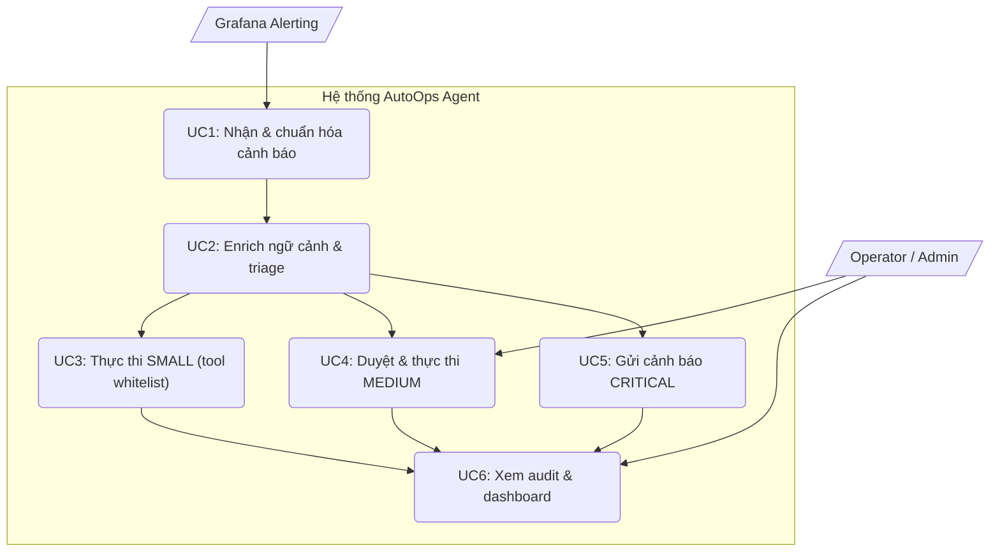
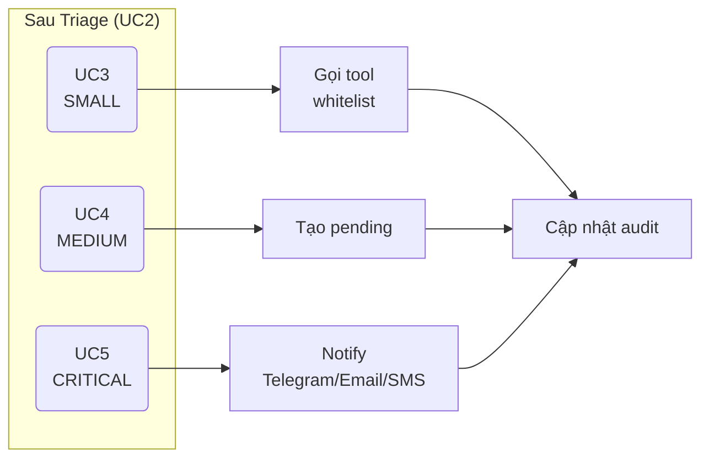
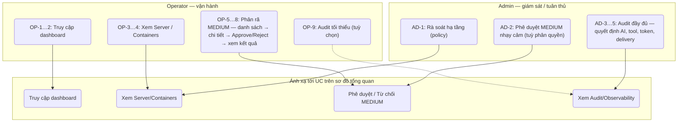
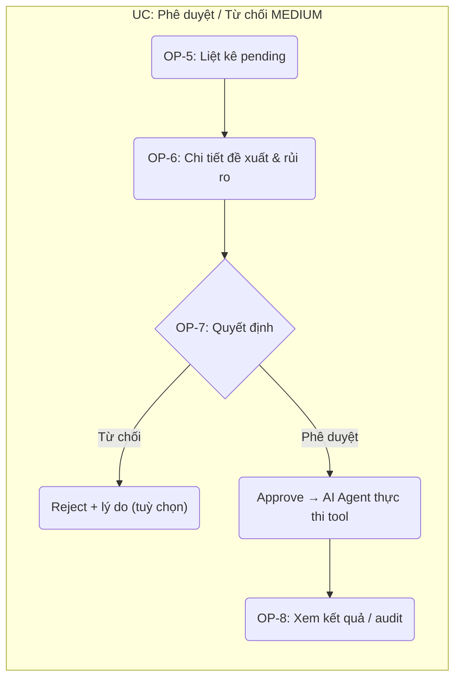
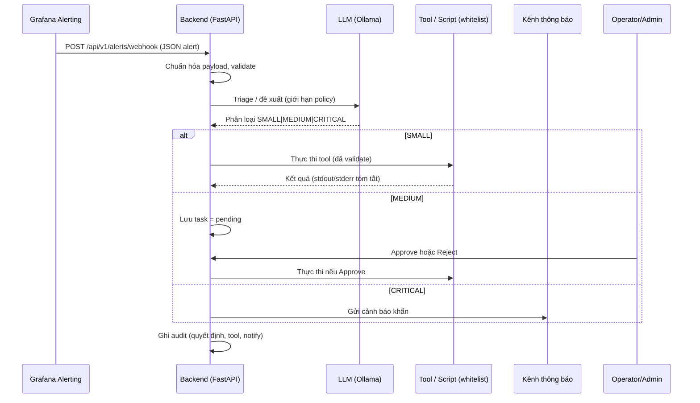

# Tài liệu đặc tả yêu cầu phần mềm (SRS)

---

## BẢO CÁO / ĐỒ ÁN

# HỆ THỐNG GIÁM SÁT AI TỰ LƯU TRỮ VÀ CẢNH BÁO TỐI ƯU CHI PHÍ  
# (AutoOps Agent — Self-Hosted AI Monitoring & Cost-Optimized Alerting)

| | |
|---|---|
| **Loại tài liệu** | Software Requirements Specification (SRS) |
| **Phiên bản** | 1.0 |
| **Phạm vi** | MVP (Minimum Viable Product) |
| **Đối tượng đọc** | Hội đồng, giảng viên, nhóm phát triển, Operator/Admin |

---

## Mục lục

| STT | Nội dung | Trang |
|:---:|:---|:---:|
| | [Danh mục hình ảnh](#danh-mục-hình-ảnh) | |
| | [Danh mục bảng biểu](#danh-mục-bảng-biểu) | |
| **1** | [Giới thiệu](#1-giới-thiệu) | |
| 1.1 | [Mục đích](#11-mục-đích) | |
| 1.2 | [Phạm vi](#12-phạm-vi) | |
| 1.3 | [Từ điển thuật ngữ](#13-từ-điển-thuật-ngữ) | |
| 1.4 | [Tài liệu tham khảo](#14-tài-liệu-tham-khảo) | |
| 1.5 | [Tổng quát](#15-tổng-quát) | |
| **2** | [Các yêu cầu chức năng](#2-các-yêu-cầu-chức-năng) | |
| 2.1 | [Các tác nhân](#21-các-tác-nhân) | |
| 2.2 | [Các chức năng của hệ thống](#22-các-chức-năng-của-hệ-thống) | |
| 2.3 | [Biểu đồ use case tổng quan](#23-biểu-đồ-use-case-tổng-quan) | |
| 2.4 | [Biểu đồ use case phân rã](#24-biểu-đồ-use-case-phân-rã) | |
| 2.4.1 | [Phân rã use case Admin / Operator](#241-phân-rã-use-case-admin--operator) | |
| 2.5 | [Quy trình nghiệp vụ *(tuỳ chọn)*](#25-quy-trình-nghiệp-vụ-tuỳ-chọn) | |
| 2.6 | [Đặc tả các use case](#26-đặc-tả-các-use-case) | |
| **3** | [Các yêu cầu phi chức năng](#3-các-yêu-cầu-phi-chức-năng) | |
| 3.1 | [Giao diện dashboard](#31-giao-diện-dashboard) | |
| 3.2 | [Tính bảo mật](#32-tính-bảo-mật) | |
| 3.3 | [Tính ràng buộc](#33-tính-ràng-buộc) | |

*Ghi chú: số trang để trống khi soạn thảo; cập nhật khi xuất bản PDF.*

---

## Danh mục hình ảnh

| Hình | Mô tả |
|:---:|:---|
| Hình 1 | Biểu đồ use case tổng quan — [§2.3](#23-biểu-đồ-use-case-tổng-quan) |
| Hình 2 | Biểu đồ use case phân rã (Admin/Operator) — [§2.4.1](#241-phân-rã-use-case-admin--operator) |
| Hình 3 | Sơ đồ trình tự xử lý cảnh báo (sequence) — [§2.5](#25-quy-trình-nghiệp-vụ-tuỳ-chọn) |

---

## Danh mục bảng biểu

| Bảng | Mô tả |
|:---:|:---|
| Bảng 1 | Từ điển thuật ngữ — [§1.3](#13-từ-điển-thuật-ngữ) |
| Bảng 2 | Ma trận tác nhân — chức năng — [§2.1](#21-các-tác-nhân) |
| Bảng 3 | Phân rã use case Operator / Admin — [§2.4.1](#241-phân-rã-use-case-admin--operator) |

---

## 1. Giới thiệu

### 1.1 Mục đích

Tài liệu SRS này nhằm **đặc tả yêu cầu** đối với hệ thống giám sát và tự động hóa vòng khép kín (Closed-loop AIOps) kết hợp **AI Agent tự lưu trữ**, phục vụ:

- Làm **cơ sở thiết kế** (kiến trúc, API, luồng nghiệp vụ).
- Làm **chuẩn kiểm thử** (yêu cầu có thể kiểm chứng — verifiable).
- Làm **tài liệu giao tiếp** giữa nhóm phát triển, người vận hành và hội đồng đánh giá.

### 1.2 Phạm vi

**Trong phạm vi MVP**

- Nhận **webhook** từ **Grafana Unified Alerting** khi có cảnh báo.
- **Triage** mức độ **SMALL / MEDIUM / CRITICAL**.
- **SMALL**: tự động xử lý bằng tool/script nằm trong **whitelist**.
- **MEDIUM**: tạo tác vụ **pending**, chờ **Operator/Admin** phê duyệt.
- **CRITICAL**: gửi **cảnh báo khẩn** (Telegram / Email / SMS tuỳ cấu hình).
- **Ghi audit**: quyết định AI, tool đã gọi, kết quả, token (nếu có).

**Ngoài phạm vi MVP**

- Tự phục hồi đa bước phức tạp; chạy shell tự do cho LLM.
- HA/scale-out chuẩn production; RAG đầy đủ như giải pháp doanh nghiệp lớn (có thể giai đoạn sau).

### 1.3 Từ điển thuật ngữ

**Bảng 1.** Thuật ngữ và viết tắt

| Thuật ngữ / Viết tắt | Định nghĩa |
|:---|:---|
| **SRS** | Software Requirements Specification — đặc tả yêu cầu phần mềm. |
| **AIOps** | Vận hành CNTT có hỗ trợ tự động hóa, phân tích và học máy/AI. |
| **Closed-loop** | Vòng khép kín: phát hiện → xử lý → phản hồi / ghi nhận / cải tiến. |
| **LLM** | Large Language Model; trong dự án: mô hình chạy nội bộ (ví dụ qua Ollama). |
| **RAG** | Retrieval-Augmented Generation — truy xuất tài liệu/playbook trước khi quyết định. |
| **Grafana Alerting** | Hệ thống cảnh báo thống nhất của Grafana, có thể gửi webhook tới endpoint tùy chỉnh. |
| **Webhook** | HTTP callback (thường POST JSON) khi sự kiện cảnh báo xảy ra. |
| **Whitelist (tool/script)** | Danh sách công cụ được phép AI gọi; ngoài danh sách bị từ chối. |
| **Severity** | Mức độ xử lý: SMALL, MEDIUM, CRITICAL. |
| **MVP** | Minimum Viable Product — phiên bản tối thiểu khả thi. |
| **NFR** | Non-Functional Requirements — yêu cầu phi chức năng. |

### 1.4 Tài liệu tham khảo

Các nguồn tham khảo có thể tra cứu khi triển khai và viết báo cáo kèm theo:

| STT | Nguồn | Ghi chú |
|:---:|:---|:---|
| [1] | [Grafana — Alerting](https://grafana.com/docs/grafana/latest/alerting/) | Cấu hình rule, contact points, webhook. |
| [2] | [Prometheus — Documentation](https://prometheus.io/docs/introduction/overview/) | Mô hình pull metrics, exporters. |
| [3] | [Grafana — Webhook notifier](https://grafana.com/docs/grafana/latest/alerting/configure-notifications/manage-contact-points/integrations/webhook-notifier/) | Tích hợp gửi payload sang hệ thống ngoài. |
| [4] | [Ollama](https://ollama.com/) | Chạy LLM self-hosted cục bộ. |
| [5] | IEEE 830-1998 (đặc tả SRS) | Khung tổ chức tài liệu yêu cầu (tham khảo tinh thần). |

### 1.5 Tổng quát

Tài liệu gồm **Phần 2** mô tả **yêu cầu chức năng** (tác nhân, chức năng, use case và đặc tả chi tiết), **Phần 3** mô tả **yêu cầu phi chức năng** (dashboard, bảo mật, ràng buộc). Luồng nghiệp vụ cốt lõi: **Grafana phát cảnh báo → Backend nhận webhook → AI/Policy triage → hành động theo mức → audit**.

---

## 2. Các yêu cầu chức năng

Quy ước: các yêu cầu bắt buộc dùng từ **shall** (phải).

### 2.1 Các tác nhân

- **Grafana Alerting (hệ thống ngoài)**: gửi HTTP POST (webhook) khi điều kiện cảnh báo thỏa.
- **AI Agent Backend (hệ thống)**: nhận cảnh báo, enrich ngữ cảnh, triage, điều phối tool và thông báo.
- **Admin (người)**: ưu tiên **audit/observability**, rà soát tuân thủ, có thể mở rộng cấu hình cấp hệ thống (tuỳ MVP).
- **Operator (người)**: **vận hành hằng ngày** — dashboard, trạng thái server/container, **phê duyệt / từ chối** tác vụ MEDIUM.
- *Ghi chú MVP:* có thể gộp một tài khoản **Operator/Admin**; khi tách vai trò, dùng bảng phân rã ở [§2.4.1](#241-phân-rã-use-case-admin--operator).
- **LLM (thành phần nội bộ)**: hỗ trợ phân loại/đề xuất hành động trong giới hạn policy.

**Bảng 2.** Ma trận tác nhân — chức năng (rút gọn)

| Chức năng / Tác nhân | Grafana | AI Agent | Operator | Admin |
|:---|:---:|:---:|:---:|:---:|
| Kích hoạt nhận cảnh báo (webhook) | ✓ | ✓ | | |
| Triage & điều phối | | ✓ | | |
| Truy cập dashboard / xem Server·Containers | | ✓ | ✓ | ○ |
| Phê duyệt MEDIUM | | ✓ | ✓ | ○ |
| Xem audit đầy đủ | | ✓ | ○ | ✓ |
| Nhận thông báo CRITICAL (Telegram/SMS/Email) | | ✓ | ✓ | ✓ |

*Ký hiệu: **✓** chính; **○** tuỳ phân quyền hoặc vai trò kết hợp.*

### 2.2 Các chức năng của hệ thống

- **FC-1** — Nhận và **chuẩn hóa** payload cảnh báo từ Grafana.
- **FC-2** — **Enrich** ngữ cảnh tối thiểu (metrics/metadata trong cửa sổ thời gian giới hạn).
- **FC-3** — **Triage** thành SMALL / MEDIUM / CRITICAL.
- **FC-4** — **Điều phối**: SMALL → thực thi tool whitelist; MEDIUM → tạo pending; CRITICAL → gửi cảnh báo khẩn.
- **FC-5** — **Phê duyệt** MEDIUM (approve/reject) và thực thi sau khi approve.
- **FC-6** — **Audit & observability**: log quyết định, tool, kết quả, token.

**Yêu cầu chức năng chi tiết (rút gọn — có thể mở rộng trong LLD)**

- **FR-A1**: Hệ thống **shall** cung cấp endpoint webhook nhận alert từ Grafana Alerting.
- **FR-A2**: Hệ thống **shall** chuẩn hóa payload thành cấu trúc nội bộ (alert_id, labels, annotations, thời gian, severity_hint, nguồn).
- **FR-C1**: Hệ thống **shall** phân loại alert thành SMALL/MEDIUM/CRITICAL.
- **FR-D1**: Hệ thống **shall** chỉ cho phép gọi tool/script trong whitelist; validate tham số trước khi thực thi.
- **FR-E1**: Hệ thống **shall** lưu task MEDIUM ở trạng thái `pending` và cung cấp API approve/reject.
- **FR-F1**: Hệ thống **shall** gửi thông báo CRITICAL tới kênh đã cấu hình và retry theo policy.
- **FR-G1**: Hệ thống **shall** lưu audit log đủ để truy vết: input → quyết định → tool → kết quả.

### 2.3 Biểu đồ use case tổng quan

**Hình 1.** Quan hệ tác nhân — use case (tổng quan)

### 2.4 Biểu đồ use case phân rã

**Hình 2 (phần 1).** Phân rã nhóm xử lý sau triage

### 2.4.1 Phân rã use case Admin / Operator

Căn cứ **sơ đồ use case tổng quan** (Admin; Prometheus; Grafana Alerting; AI Agent; Telegram/SMS/Email), nhóm use case **gắn con người** gồm bốn mục lớn: *Truy cập dashboard*, *Xem trạng thái Server/Containers*, *Phê duyệt / Từ chối MEDIUM*, *Xem Audit/Observability*. Phần dưới **chỉ rõ phân rã** theo **Operator** (vận hành) và **Admin** (giám sát/tuân thủ).

**Bảng 3.** Ánh xạ use case tổng quan → phân rã (Operator / Admin)

| UC trên sơ đồ tổng quan | Operator — phân rã (mức chi tiết) | Admin — phân rã (mức chi tiết) |
|:---|:---|:---|
| **Truy cập dashboard** | **OP-1** Mở dashboard Grafana (hoặc UI tích hợp). **OP-2** Chọn view (alert, node, container — tuỳ bảng đã dựng). | Thường **dùng chung** với Operator; Admin có thể tập trung panel “audit / agent” nếu tách dashboard. |
| **Xem trạng thái Server/Containers** | **OP-3** Xem metrics tổng quan (CPU/RAM/Disk/Net). **OP-4** Drill-down theo host/container liên quan cảnh báo. | **AD-1** (tuỳ chính sách) Rà soát tình trạng hạ tầng trước khi thay đổi policy/whitelist. |
| **Phê duyệt / Từ chối tác vụ MEDIUM** | **OP-5** Xem danh sách task `pending`. **OP-6** Xem chi tiết đề xuất hành động & rủi ro. **OP-7** **Approve** hoặc **Reject** (có thể kèm lý do). **OP-8** *(include)* Xem kết quả sau khi hệ thống thực thi (nếu Approve). | **AD-2** *(tuỳ tổ chức)* Phê duyệt các MEDIUM **nhạy cảm** (escalation) hoặc chỉ **giám sát** (read-only) tùy phân quyền. |
| **Xem Audit/Observability** | **OP-9** *(optional)* Xem tối thiểu: trạng thái task vừa xử lý, log ngắn phục vụ ca trực. | **AD-3** Tra cứu **log/audit** theo thời gian / `alert_id` / `task_id`. **AD-4** Xem **quyết định AI**, **tool đã gọi**, **token usage**. **AD-5** Xem **trạng thái gửi** CRITICAL (thành công / thất bại / retry). |

*Trong MVP một người có thể đảm nhiệm cả hai vai; khi đó gộp **Operator + Admin** thành một dòng tác nhân trên sơ đồ.*

**Hình 2 (phần 2).** Phân rã theo hai tuyến Operator / Admin

**Hình 2 (phần 3).** Phân rã chi tiết **chỉ** luồng MEDIUM (khớp AI Agent: pending + cập nhật trạng thái)

### 2.5 Quy trình nghiệp vụ *(tuỳ chọn)*

Luồng tổng thể có thể minh họa bằng **sơ đồ trình tự** (tương tự phong cách “sequence” trong tài liệu mẫu).

**Hình 3.** Sequence — từ cảnh báo Grafana đến hành động & audit

**Giải thích ngắn (mapping bước):**

1. Grafana kích hoạt rule → gửi webhook tới Backend.  
2. Backend chuẩn hóa và (tuỳ cấu hình) gọi LLM để triage / đề xuất trong giới hạn.  
3. Theo mức: thực thi tool (SMALL), tạo pending (MEDIUM), hoặc notify (CRITICAL).  
4. Mọi nhánh đều ghi nhận **audit** để quan sát và đánh giá sau vận hành.

### 2.6 Đặc tả các use case

#### 2.6.1 UC1 — Nhận & chuẩn hóa cảnh báo (Webhook)

| Mục | Nội dung |
|:---|:---|
| **Mục tiêu** | Tiếp nhận cảnh báo từ Grafana và lưu trạng thái xử lý ban đầu. |
| **Tác nhân chính** | Grafana Alerting |
| **Tiền điều kiện** | Webhook đã cấu hình; endpoint Backend hoạt động. |
| **Hậu điều kiện** | Alert có `alert_id` nội bộ; sẵn sàng cho UC2. |
| **Luồng chính** | 1) Grafana POST JSON → 2) Validate schema → 3) Map sang mô hình nội bộ → 4) Trả mã HTTP phù hợp. |
| **Luồng ngoại lệ** | Payload sai: trả 4xx, ghi log; không tạo bản ghi hợp lệ. |

#### 2.6.2 UC2 — Enrich & Triage

| Mục | Nội dung |
|:---|:---|
| **Mục tiêu** | Bổ sung ngữ cảnh tối thiểu và gán SMALL/MEDIUM/CRITICAL. |
| **Tác nhân chính** | AI Agent Backend (có thể dùng LLM + rule fallback). |
| **Tiền điều kiện** | UC1 hoàn thành. |
| **Hậu điều kiện** | `severity` xác định; audit cập nhật bước quyết định. |
| **Luồng chính** | 1) Lấy metrics/metadata trong khoảng thời gian giới hạn → 2) Gọi LLM/rule → 3) Chuyển tới UC3/UC4/UC5. |

#### 2.6.3 UC3 — Thực thi SMALL (tool whitelist)

| Mục | Nội dung |
|:---|:---|
| **Mục tiêu** | Tự động khắc phục lỗi nhỏ bằng tool được phép. |
| **Tiền điều kiện** | UC2 xác định SMALL; tool và tham số hợp lệ. |
| **Luồng chính** | Validate → thực thi → ghi kết quả → audit. |
| **Ngoại lệ** | Tool lỗi / circuit breaker: ghi `failed`, không mở rộng quyền. |

#### 2.6.4 UC4 — Duyệt & thực thi MEDIUM

| Mục | Nội dung |
|:---|:---|
| **Mục tiêu** | Đảm bảo hành động rủi ro trung bình có **con người** phê duyệt. |
| **Tác nhân** | Operator/Admin |
| **Luồng chính** | Tạo `pending` → Admin xem đề xuất → Approve/Reject → nếu Approve thì thực thi tương tự UC3. |

#### 2.6.5 UC5 — Cảnh báo CRITICAL

| Mục | Nội dung |
|:---|:---|
| **Mục tiêu** | Thông báo khẩn tới người trực chiến qua kênh đã cấu hình. |
| **NFR liên quan** | Độ trễ gửi (xem §3). |

#### 2.6.6 UC6 — Xem audit & dashboard

| Mục | Nội dung |
|:---|:---|
| **Mục tiêu** | Quan sát trạng thái hệ thống và lịch sử quyết định. |
| **Tác nhân** | Operator/Admin |

---

## 3. Các yêu cầu phi chức năng

### 3.1 Giao diện dashboard

- **NFR-UI-1**: Operator/Admin **shall** xem được trạng thái **pending approvals** và thực hiện quyết định trong **≤ 3 thao tác** (MVP).
- **NFR-UI-2**: Dashboard (Grafana hoặc UI tối giản) **shall** hiển thị tối thiểu: danh sách tác vụ chờ duyệt, kết quả gần nhất, liên kết tới chi tiết audit (nếu có).
- **NFR-UI-3**: Trình bày rõ **mức độ** (SMALL/MEDIUM/CRITICAL) và **thời gian** nhận cảnh báo.

### 3.2 Tính bảo mật

- **NFR-S-1**: Dữ liệu giám sát, log và audit **không rời** môi trường self-hosted (MVP).
- **NFR-S-2**: Không cấp **quyền shell tự do** cho LLM; chỉ **tool whitelist** + validate tham số + **least privilege** khi thực thi.
- **NFR-S-3**: Endpoint phê duyệt / API nhạy cảm **shall** có xác thực tối thiểu (API key hoặc cơ chế nội bộ tương đương MVP).

### 3.3 Tính ràng buộc

- **NFR-C-1**: **Chi phí token API bên ngoài = 0** (LLM self-host) — ràng buộc kinh phí.
- **NFR-C-2**: **Phần cứng** hạn chế → ưu tiên mô hình nhỏ / quantized; giới hạn kích thước context gửi LLM.
- **NFR-C-3**: Triển khai MVP ưu tiên **Docker Compose**; tương thích **Linux server** hoặc **Windows + Docker Desktop**.
- **NFR-C-4**: **NFR-P1** (hiệu năng): CRITICAL — gửi thông báo **< 30s (p95)** trong điều kiện bình thường; xử lý webhook (không tính thời gian LLM) **< 2s** cho một alert điển hình.

---

## Phụ lục — Tiêu chí nghiệm thu MVP (tham khảo)

- Rule demo (ví dụ CPU > 90%) tạo alert và đi đúng nhánh SMALL/MEDIUM/CRITICAL.
- MEDIUM luôn ở `pending` cho đến khi Admin approve.
- CRITICAL luôn kích hoạt notify trong ngưỡng trễ đã nêu (demo).
- Audit có đủ chuỗi: input → quyết định → tool → kết quả.

---

*Tài liệu kết thúc.*
