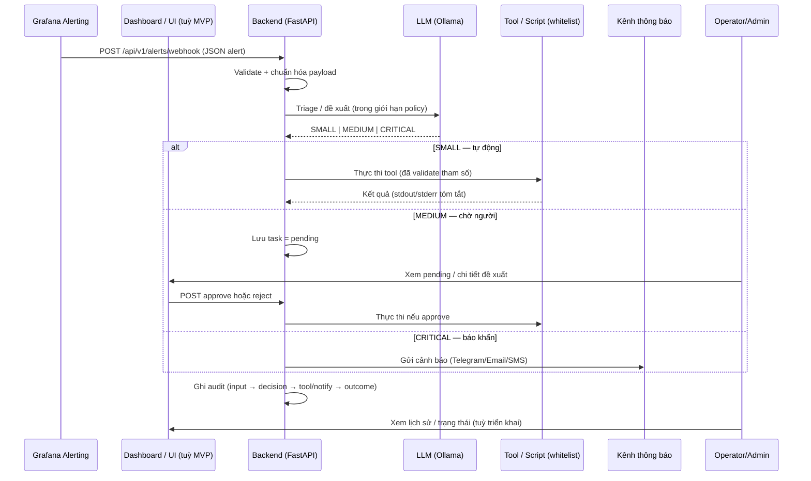

# Self-Hosted AI Agent Monitor System

## Giới thiệu

Hệ thống giám sát và tự động hóa khép kín (Closed-loop AIOps) dành cho hạ tầng máy chủ. Dự án kết hợp Prometheus để cào (pull) dữ liệu giám sát và một AI Agent tự lưu trữ (self-hosted) [1] đóng vai trò như kỹ sư SRE.

## Bài toán và giá trị

Đề tài phù hợp cho **MVP nhanh** và **tối ưu chi phí**, giải quyết “pain point” phổ biến: **chi phí API AI** và **rủi ro lộ dữ liệu** khi đưa log/metrics ra ngoài.

- **0đ token**: chạy LLM nội bộ 100% (self-hosted).
- **Data sovereignty**: dữ liệu giám sát/log không rời khỏi hạ tầng nội bộ.
- **Giảm MTTR**: tự động xử lý lỗi lặp lại (các lỗi vặt) theo playbook.

## Mục tiêu cốt lõi

- **Giám sát:** Theo dõi CPU, RAM, Disk, Network và Docker container [2].
- **Tự động hóa 3 cấp độ:** Phân loại lỗi thành Nhỏ (Small — tự xử lý), Trung bình (Medium — hỏi ý kiến), và Nghiêm trọng (Critical — báo động đỏ) [2].
- **Tối ưu chi phí và bảo mật:** Tự lưu trữ LLM (0 chi phí API Token), ngăn chặn AI “chạy lan” và đảm bảo dữ liệu không rời khỏi server nội bộ [3].

## Tech Stack

- **Monitoring:** Prometheus, Node Exporter, cAdvisor, Grafana.
- **AI Core:** Self-hosted LLM (Ollama), Vector Database (RAG — giai đoạn sau MVP).
- **Backend:** Python (FastAPI), LangChain/n8n.

## Kỹ thuật tiêu biểu

- **Pull-based Monitoring:** Prometheus + exporters (Node Exporter, cAdvisor).
- **Self-hosted LLM:** mô hình mã nguồn mở (ví dụ Llama 3 / Mistral) chạy cục bộ qua Ollama.
- **RAG (giai đoạn sau MVP):** truy xuất playbook + lịch sử lỗi để giảm ảo giác.
- **Function Calling / Tool Use:** ép AI chỉ gọi đúng tool/script được định nghĩa sẵn.
- **Visualization và Approval:** Grafana dashboard + bảng “Pending approvals” cho mức Medium.

## Đối tượng hướng tới

- **Operator/Admin (DevOps/Sysadmin/SRE gộp vai trò):** giảm thao tác xử lý sự cố lặp lại, giảm trực đêm.
- **Doanh nghiệp vừa và nhỏ (SMEs):** giám sát/tự động hóa nhưng không đủ ngân sách SaaS và không muốn dữ liệu ra Internet.

---

## 1. Luồng xử lý (tổng quan)

```
┌─────────────────────────┐
│   Grafana Alerting      │
│   ───────────────────   │
│   Rule kích hoạt        │
│   (vd: CPU > 90%)       │
│   → POST webhook        │
└───────────┬─────────────┘
            │  (HTTP POST /api/v1/alerts/webhook)
            ▼
┌────────────────────────────┐
│   Backend (FastAPI)        │
│   AutoOps Agent            │
│                            │
│ 1) Nhận & chuẩn hóa JSON   │
│ 2) Enrich ngữ cảnh tối thiểu│
│ 3) Triage SMALL/MEDIUM/     │
│    CRITICAL (LLM + policy) │
└───────────┬────────────────┘
            │
     ┌──────┴──────┬──────────────┐
     ▼             ▼              ▼
┌─────────┐  ┌─────────────┐  ┌──────────────┐
│ SMALL   │  │ MEDIUM      │  │ CRITICAL     │
│ Tool    │  │ pending →   │  │ Telegram /   │
│ whitelist│ │ Admin duyệt │  │ Email / SMS  │
└────┬────┘  └──────┬──────┘  └──────┬───────┘
     │              │                 │
     └──────────────┴─────────────────┘
                    ▼
         ┌──────────────────────┐
         │  Audit & observability│
         │  (quyết định, tool,   │
         │   notify, token)     │
         └──────────────────────┘
```

## 2. Sơ đồ luồng tổng thể (sequence)



## 3. Giải thích luồng hoạt động

```text
1) Grafana đánh giá rule → khi vi phạm ngưỡng, Contact Point gửi webhook tới Backend.
2) Backend chuẩn hóa alert, gắn ngữ cảnh tối thiểu (metrics/metadata trong cửa sổ giới hạn).
3) Hệ thống triage thành SMALL / MEDIUM / CRITICAL (LLM hoặc rule fallback).
4) SMALL: chỉ gọi tool/script trong whitelist, validate tham số, ghi kết quả + audit.
5) MEDIUM: tạo bản ghi pending; Operator/Admin approve/reject; chỉ thực thi sau approve.
6) CRITICAL: gửi thông báo khẩn tới kênh đã cấu hình (retry theo policy).
7) Mọi nhánh cập nhật audit để truy vết và vận hành sau này.
```

---

## Lộ trình MVP

- **Bước 1 (1–2 ngày):** dựng monitoring cơ bản bằng Docker Compose, cấu hình Grafana Unified Alerting bắn webhook khi CPU > 90%.
- **Bước 2 (3–5 ngày):** AI Agent backend bằng FastAPI nhận webhook, gọi LLM nhỏ chạy cục bộ.
- **Bước 3 (2–3 ngày):** triage SMALL/MEDIUM/CRITICAL và router hành động:
  - **SMALL:** chạy script/tool (ví dụ: clear cache / xóa log).
  - **MEDIUM:** ghi “pending” vào log/DB chờ admin duyệt.
  - **CRITICAL:** gửi cảnh báo khẩn (ví dụ: Telegram Bot API).
- **Bước 4 (2 ngày):** Grafana hoặc UI hiển thị bảng duyệt lệnh Medium và nút Approve/Reject.

## Thách thức chính và hướng xử lý

- **Hallucination / chọn sai tool:** output định dạng chuẩn (ví dụ JSON) + function calling nghiêm ngặt + circuit breaker.
- **Giới hạn phần cứng:** ưu tiên model nhỏ/quantized (GGUF) tối ưu cho tool use.
- **Phân quyền và bảo mật:** không cấp shell tự do; chỉ script/tool đã whitelist, least privilege.

## Tài liệu liên quan

- Đặc tả yêu cầu chi tiết (SRS): xem file `SRS.md` trong cùng thư mục dự án.
