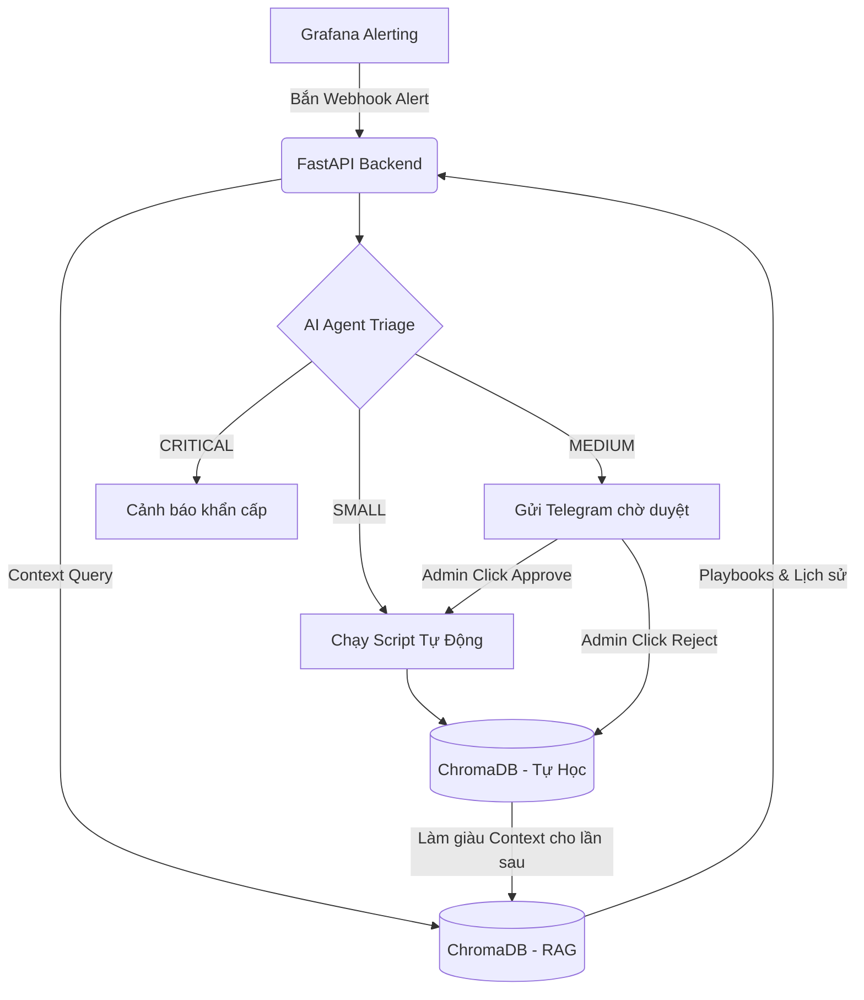

# 🤖 AutoOps Agent: Self-Hosted AI Monitoring & Cost-Optimized Alerting System


Một hệ thống giám sát và tự động hóa khép kín (**Closed-loop AIOps**) dành cho hạ tầng máy chủ. Dự án kết hợp sức mạnh của Prometheus/Grafana trong việc thu thập dữ liệu giám sát và một AI Agent đóng vai trò như một kỹ sư SRE (Site Reliability Engineer) mẫn cán, hoạt động 24/7.

---

## 🌟 Lý Do Ra Đời (Why this project?)

Trong quá trình vận hành hệ thống thực tế, các kỹ sư DevOps/SRE thường phải đối mặt với các "pain point":

1. **Lặp lại nhàm chán:** Hơn 70% các cảnh báo (alerts) là những lỗi lặp đi lặp lại có thể xử lý theo playbook cố định (ví dụ: đầy ổ cứng C, kẹt tiến trình CPU, sập service phụ).
2. **Rủi ro lộ lọt dữ liệu & Chi phí API:** Việc gửi log hệ thống nhạy cảm ra ngoài cho các dịch vụ AI bên thứ ba vừa tốn kém, vừa vi phạm quy định bảo mật (Data Sovereignty).
3. **Chậm trễ trong xử lý:** Thời gian phản hồi sự cố (MTTR) thường bị trì hoãn do phụ thuộc vào con người trực ca (on-call).

**AutoOps Agent** ra đời như một MVP hoàn hảo giúp:

- **Giữ dữ liệu giám sát an toàn 100%** không rời khỏi hạ tầng (khi kết hợp Local LLM).
- Rút ngắn thời gian phục hồi (MTTR) từ hàng giờ xuống còn vài giây thông qua Auto-Remediation.
- Tối ưu hóa hoàn toàn chi phí bảo trì hệ thống.

---

## 🚀 Các Tính Năng Nổi Bật (Core Features)

- 📊 **Giám sát thông minh (Smart Monitoring):** Thu thập metrics (CPU, RAM, Disk, Docker) thông qua hệ sinh thái Prometheus & Grafana.
- 🧠 **Phân loại sự cố 3 Cấp độ (Triaging):**
  - **🟢 SMALL (Tự động):** AI tự động xử lý các lỗi vặt thông qua Whitelist Scripts (Ví dụ: Dọn rác ổ đĩa tự động).
  - **🟡 MEDIUM (Chờ Duyệt - Human-in-the-loop):** AI Đề xuất giải pháp và gửi thông báo về Telegram. Chờ Admin bấm nút `[Phê duyệt]` hoặc `[Từ chối]` ngay trên tin nhắn chat trước khi thực thi.
  - **🔴 CRITICAL (Báo Động):** Phân tích nguyên nhân gốc rễ (Root Cause Analysis) và gửi báo động đỏ khẩn cấp tới đội ngũ.
- 📚 **AI Tự Học (Log Learning với RAG):** Kết hợp Vector Database (ChromaDB), AI sẽ tự động học hỏi từ các kết quả xử lý sự cố trước đó (Resolution) để đưa ra quyết định chính xác hơn cho tương lai.

---

## 🛠️ Công Cụ Tiêu Biểu (Tech Stack)

Hệ thống được xây dựng trên các công nghệ hiện đại và linh hoạt nhất:
- **Monitoring & Alerting:** Prometheus, Node Exporter, Grafana.
- **Backend & API:** Python, FastAPI (Tốc độ cực cao, kiến trúc bất đồng bộ).
- **AI Core & Logic:** LangChain, Google Gemini (hoặc mô hình nội bộ Llama/Mistral qua Ollama).
- **Knowledge Base (RAG):** ChromaDB (Vector Database lưu Playbooks và Log Learning).
- **Integration:** Telegram Bot API (Tương tác phê duyệt), Ngrok (Webhook Tunneling) và SQLite (Audit Database).

---

## 🏗️ Kiến Trúc Hệ Thống (Architecture)

### 1. Luồng Hoạt Động Tổng Quan



### 2. Chi Tiết Pipeline Duyệt Lệnh (Approval Flow)

- **Log / Alert:** Grafana bắt sự cố (vd: CPU > 90%) -> Gửi POST Request đến Agent.
- **AI Phân tích:** Agent tự động thu thập Windows Event Logs, kết hợp dữ liệu từ RAG -> LLM phân tích -> Đề xuất lệnh xử lý.
- **Telegram Webhook:** Agent đẩy tin nhắn qua Telegram kèm các nút bấm `Phê duyệt` và `Từ chối`.
- **Thực thi:** Admin bấm nút -> Telegram đẩy Webhook qua Ngrok về Agent -> Agent gọi PowerShell Script để sửa lỗi (hoặc hủy lệnh).
- **Audit & Học Tập:** Ghi log chi tiết vào SQLite (`audit_logs`) và Embed kết quả ngược vào ChromaDB để rèn luyện trí thông minh cho AI.

---

## Cấu Trúc Thư Mục (Folder Architecture)

Dự án được tổ chức theo cấu trúc module hóa, tách biệt rõ ràng giữa các thành phần giám sát, logic AI và script thực thi:

```text
AutoOps-Agent-System/
├── agent_api/           # Bộ não AI Agent (Backend)
│   ├── app/             # Chứa mã nguồn chính của FastAPI, tích hợp LLM & RAG
│   ├── tests/           # Các kịch bản test tự động (test Webhook, DB)
│   └── storage/         # Nơi lưu trữ SQLite Database và ChromaDB (Vector DB)
├── observability/       # Hạ tầng giám sát
│   ├── prometheus/      # Cấu hình thu thập metrics
│   ├── grafana/         # Cấu hình Dashboard và Alert Rules
│   └── docker-compose   # Triển khai toàn bộ stack giám sát bằng Docker
├── tools/               # Hộp công cụ (Whitelist Scripts)
│   └── powershell/      # Chứa các script Auto-Remediation an toàn (vd: restart_service.ps1)
├── demo_scripts/        # Script mô phỏng lỗi (Dành cho mục đích Testing/Demo)
├── Project skill/       # Tài liệu dự án (Nhật ký phát triển theo ngày, thiết kế luồng)
└── docs/                # Tài liệu đặc tả kỹ thuật (SRS, Playbooks)
```

**Chi tiết tác dụng của từng folder:**

- **`agent_api/`**: Đây là trái tim của hệ thống. Nhận Webhook từ Grafana, tương tác với AI (Gemini/Ollama) để phân loại lỗi, xử lý Logic phê duyệt Telegram và cập nhật cơ sở dữ liệu.
- **`observability/`**: Tập trung hoàn toàn vào việc đo lường và phát hiện sự cố. Đóng vai trò là "con mắt" của hệ thống, cào dữ liệu liên tục và gửi báo động.
- **`tools/`**: Đóng vai trò là "tay chân" của hệ thống. Chứa các script khắc phục sự cố (Auto-remediation) đã được xét duyệt kỹ lưỡng để Agent an tâm thực thi mà không gây hại.
- **`demo_scripts/`**: Chứa các đoạn mã để bạn cố tình tạo ra sự cố (như làm quá tải CPU, đánh sập service) để xem Agent phản ứng như thế nào.

---

## 📈 Lợi Ích & Đầu Ra Mong Muốn (Benefits)

1. **Zero-Touch Resolution:** Tự động sửa chữa các lỗi thông thường, giảm thiểu đáng kể thao tác thủ công và những đêm thức trắng của các kĩ sư SRE.
2. **Kiểm Soát Rủi Ro Tuyệt Đối:** Cơ chế duyệt qua Telegram đảm bảo hệ thống không bao giờ bị phá hỏng bởi "ảo giác" (hallucination) của AI. Con người luôn là người ra quyết định cuối cùng ở các tác vụ nhạy cảm.
3. **Khả Năng Mở Rộng Dễ Dàng:** Chỉ cần nạp thêm Script (Bash/PowerShell) vào thư mục `tools` và khai báo Playbook, AI sẽ lập tức biết cách sử dụng để chống chọi với các sự cố mới.
4. **Hệ Sinh Thái Thông Minh Lên Từng Ngày:** Nhờ cơ chế Log Learning, hệ thống càng vận hành lâu, AI càng hiểu rõ đặc thù dự án và xử lý lỗi càng "chuẩn xác".

---

*Dự án AutoOps Agent - Định hình lại cách chúng ta vận hành hạ tầng công nghệ!*
