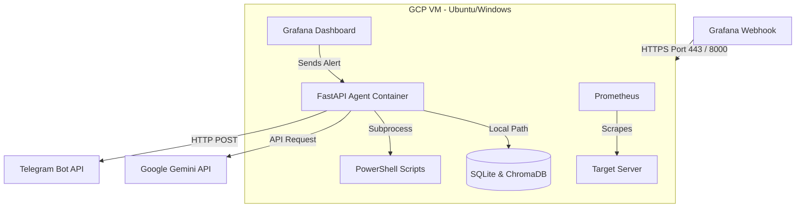
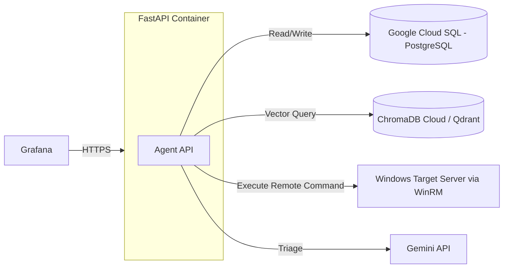

# Hướng dẫn Triển khai Hệ thống AutoOps Agent lên Google Cloud Platform (GCP)

Tài liệu này cung cấp các mô hình kiến trúc và hướng dẫn từng bước để triển khai hệ thống **AutoOps Agent** (bao gồm FastAPI Backend, Prometheus, Grafana, SQLite và ChromaDB) lên **Google Cloud Platform (GCP)**.

---

## 1. Phân tích Kiến trúc Triển khai trên GCP

Do hệ thống của bạn có các thành phần đặc thù:
1. **FastAPI Backend (Agent API)**: Cần chạy liên tục để nhận Webhook từ Grafana.
2. **SQLite (`agent.db`) & ChromaDB (`chroma_db`)**: Lưu trữ cục bộ (Stateful), cần bộ lưu trữ bền vững (Persistent Storage).
3. **PowerShell Scripts (`.ps1`)**: Chạy lệnh hệ thống để khắc phục sự cố (ví dụ: dọn dẹp temp, restart service).
4. **Prometheus & Grafana**: Cần cấu hình thu thập metric và cấu hình Dashboard/Contact Point.

Dựa trên các đặc thù này, có **2 phương án triển khai chính** trên GCP:

### So sánh các Phương án Triển khai

| Tiêu chí | Phương án A: Google Compute Engine (VM) <br> *(Khuyến nghị)* | Phương án B: Google Cloud Run (Serverless) <br> *(Chỉ dùng cho API)* |
| :--- | :--- | :--- |
| **Độ phức tạp** | **Thấp** (Chạy toàn bộ stack qua `docker-compose`) | **Trung bình - Cao** (Cần tách dịch vụ) |
| **Tính bền vững dữ liệu** | **Tốt** (Dữ liệu SQLite/ChromaDB lưu trực tiếp trên Persistent Disk) | **Kém** (Cloud Run là Stateless, cần chuyển SQLite sang Cloud SQL) |
| **Chạy PowerShell** | **Dễ dàng** (Có thể chạy trực tiếp nếu dùng Windows VM, hoặc chạy remote từ Linux VM) | **Khó** (Môi trường Linux container, bắt buộc phải gọi lệnh Remote qua SSH/WinRM) |
| **Chi phí** | Cố định theo tháng (Ví dụ: VM `e2-medium` khoảng $25/tháng) | Theo lượng request (Tự động scale về 0 khi không có alert, cực kỳ rẻ) |

---

## 2. Phương án A: Triển khai trên Google Compute Engine (VM) - KHUYẾN NGHỊ

Đây là cách nhanh nhất và an toàn nhất để đưa toàn bộ hệ thống lên Cloud mà không phải cấu hình lại Database hoặc cơ chế lưu trữ.



### Bước 1: Tạo VM Instance trên GCP
1. Truy cập vào **GCP Console** -> **Compute Engine** -> **VM Instances** -> Bấm **Create Instance**.
2. Thiết lập cấu hình:
   - **Name**: `autoops-monitoring-server`
   - **Region**: Chọn region gần bạn nhất (ví dụ: `asia-southeast1` - Singapore).
   - **Machine configuration**: Chọn dòng General-purpose -> Machine type: `e2-small` (2 vCPU, 2GB RAM) hoặc `e2-medium` (2 vCPU, 4GB RAM) để đảm bảo RAM chạy cả Docker Compose + ChromaDB.
   - **Boot disk**:
     - *Lựa chọn 1 (Linux)*: Chọn **Ubuntu 22.04 LTS**, Disk type: **Balanced Persistent Disk**, Size: **30 GB** (Khuyến nghị cho độ ổn định).
     - *Lựa chọn 2 (Windows)*: Nếu bạn muốn chạy PowerShell local trực tiếp để tự khắc phục trên chính VM đó, hãy chọn **Windows Server 2022 Datacenter**.
   - **Firewall**: Tích chọn **Allow HTTP traffic** và **Allow HTTPS traffic**.
3. Bấm **Create**.

### Bước 2: Cài đặt Docker & Docker Compose (Dành cho Ubuntu VM)
Sau khi VM được khởi tạo, bấm vào nút **SSH** để kết nối trực tiếp vào VM và chạy các lệnh sau:

```bash
# Cập nhật hệ thống
sudo apt update && sudo apt upgrade -y

# Cài đặt Docker
sudo apt-get install -y ca-certificates curl gnupg lsb-release
sudo mkdir -p /etc/apt/keyrings
curl -fsSL https://download.docker.com/linux/ubuntu/gpg | sudo gpg --dearmor -o /etc/apt/keyrings/docker.gpg
echo "deb [arch=$(dpkg --print-architecture) signed-by=/etc/apt/keyrings/docker.gpg] https://download.docker.com/linux/ubuntu $(lsb_release -cs) stable" | sudo tee /etc/apt/sources.list.d/docker.list > /dev/null
sudo apt update
sudo apt-get install -y docker-ce docker-ce-cli containerd.io docker-compose-plugin

# Cấp quyền chạy Docker không cần sudo
sudo usermod -aG docker $USER
newgrp docker
```

### Bước 3: Đồng bộ mã nguồn lên VM
Bạn có thể clone repository trực tiếp từ GitHub lên VM:
```bash
git clone https://github.com/ToriToriisme/AutoOps-Agent-Self-Hosted-AI-Monitoring-and-Cost-Optimized-Alerting-System.git
cd AutoOps-Agent-Self-Hosted-AI-Monitoring-and-Cost-Optimized-Alerting-System
```

### Bước 4: Cấu hình biến môi trường
Tạo file `.env` cho Agent tại `agent_api/.env`:
```bash
nano agent_api/.env
```
Nhập các cấu hình của bạn:
```env
GOOGLE_API_KEY=your_gemini_api_key_here
AGENT_API_KEY=your_secure_webhook_key_here
TELEGRAM_BOT_TOKEN=your_telegram_bot_token
TELEGRAM_CHAT_ID=your_telegram_chat_id
```
> [!IMPORTANT]
> Nhớ tạo thêm thư mục lưu trữ DB trên VM để Docker mount:
> ```bash
> mkdir -p agent_api/storage
> chmod -R 777 agent_api/storage
> ```

### Bước 5: Chạy Docker Compose
Tại thư mục chứa file `docker-compose.yml` (trong thư mục `observability`), tiến hành khởi động stack:
```bash
docker compose up -d
```
Kiểm tra xem các container đã hoạt động chưa:
```bash
docker ps
```

### Bước 6: Cấu hình GCP Firewall (Mở Port)
Mặc định GCP sẽ khóa các port như `3001` (Grafana) và `8000` (FastAPI). Bạn cần tạo Luật Tường lửa (Firewall Rule):
1. Tìm kiếm **VPC network** trên GCP Console -> Chọn **Firewalls**.
2. Bấm **Create Firewall Rule**:
   - **Name**: `allow-autoops-ports`
   - **Targets**: `All instances in the network` (hoặc gắn Target tag cụ thể).
   - **Source IPv4 ranges**: `0.0.0.0/0` (Nếu muốn public truy cập công cộng) hoặc chỉ cho phép IP của bạn.
   - **Protocols and ports**: Chọn **Specified protocols and ports**, tích chọn **TCP** và nhập: `3001, 8000`.
3. Bấm **Create**.

Bây giờ bạn có thể truy cập:
- Grafana: `http://<IP_CUA_VM>:3001` (Mặc định `admin`/`admin`)
- API Health Check: `http://<IP_CUA_VM>:8000/health`

---

## 3. Phương án B: Triển khai Serverless trên Google Cloud Run (Chỉ dành cho Agent API)

Nếu bạn muốn tiết kiệm chi phí tối đa cho API Backend và không muốn quản lý VM, bạn có thể chạy API trên Cloud Run. Tuy nhiên, bạn phải giải quyết bài toán dữ liệu bền vững và gọi lệnh PowerShell từ xa.

### Khắc phục hạn chế của Cloud Run:
1. **Dữ liệu SQLite/ChromaDB**: Cloud Run sẽ reset ổ cứng mỗi khi container khởi động lại hoặc scale. Để giữ lại dữ liệu:
   - **Giải pháp:** Chuyển đổi `database.py` sang dùng **Cloud SQL (PostgreSQL)**.
   - Hoặc gắn thêm **Cloud Storage bucket** vào Cloud Run container dưới dạng thư mục lưu trữ (Cloud Storage FUSE Mount), tuy nhiên hiệu năng SQLite trên FUSE sẽ rất chậm và dễ bị lỗi khóa file (Locking).
2. **PowerShell Execution**: Container Cloud Run chạy môi trường Linux và không thể tương tác trực tiếp với máy ảo Windows khác.
   - **Giải pháp:** Trong file `main.py`, sửa logic chạy script `subprocess.run(["powershell", ...])` thành lệnh gọi API hoặc SSH/WinRM từ xa đến server Windows thật cần sửa lỗi.



### Các bước triển khai lên Cloud Run:

#### Bước 1: Bật các API cần thiết trên GCP
Mở terminal cục bộ (đã cài đặt Google Cloud SDK) hoặc dùng GCP Cloud Shell:
```bash
gcloud services enable artifactregistry.googleapis.com run.googleapis.com
```

#### Bước 2: Tạo Artifact Registry để chứa Docker Image
```bash
gcloud artifacts repositories create autoops-repo \
    --repository-format=docker \
    --location=asia-southeast1 \
    --description="Repository chua image AutoOps Agent"
```

#### Bước 3: Build và Push Image lên Registry
Di chuyển vào thư mục `agent_api` trên máy của bạn và chạy lệnh sau (thay thế `PROJECT_ID` bằng ID dự án GCP của bạn):
```bash
# Cấu hình docker xác thực với GCP
gcloud auth configure-docker asia-southeast1-docker.pkg.dev

# Build image cho môi trường Linux amd64 (quan trọng khi build từ chip Apple M1/M2)
docker build --platform linux/amd64 -t asia-southeast1-docker.pkg.dev/[PROJECT_ID]/autoops-repo/autoops-agent:latest .

# Push image lên GCP Artifact Registry
docker push asia-southeast1-docker.pkg.dev/[PROJECT_ID]/autoops-repo/autoops-agent:latest
```

#### Bước 4: Deploy lên Google Cloud Run
Chạy lệnh deploy container lên Cloud Run:
```bash
gcloud run deploy autoops-agent \
    --image=asia-southeast1-docker.pkg.dev/[PROJECT_ID]/autoops-repo/autoops-agent:latest \
    --platform=managed \
    --region=asia-southeast1 \
    --allow-unauthenticated \
    --port=8000 \
    --set-env-vars="GOOGLE_API_KEY=your_gemini_key,AGENT_API_KEY=your_secure_key,TELEGRAM_BOT_TOKEN=your_bot_token,TELEGRAM_CHAT_ID=your_chat_id"
```
Sau khi hoàn tất, Cloud Run sẽ trả về một **Service URL** dạng HTTPS (ví dụ: `https://autoops-agent-xxxx-as.a.run.app`).

#### Bước 5: Cấu hình Grafana Webhook
Quay lại Grafana của bạn, cập nhật URL của Contact Point Webhook thành:
`https://autoops-agent-xxxx-as.a.run.app/api/v1/alerts/webhook`
Đồng thời cấu hình Custom Header:
- Key: `X-API-Key`
- Value: `your_secure_key`

---

## 4. Bảo mật & Giám sát chi phí (Best Practices)

Để hệ thống vận hành tối ưu trên GCP, bạn nên thực hiện các khuyến nghị sau:

1. **Sử dụng Cloud Secret Manager**:
   Thay vì truyền trực tiếp API Key của Gemini hay Token Telegram qua biến môi trường dạng plaintext, hãy lưu chúng vào **Secret Manager** của GCP và phân quyền cho Cloud Run / Compute Engine Service Account truy cập.
2. **Thiết lập Budget Alert**:
   Truy cập **Billing** -> **Budgets & alerts** trên GCP để tạo cảnh báo nếu chi phí vượt quá ngưỡng mong muốn (ví dụ: $5/tháng) để tránh phát sinh chi phí ngoài ý muốn do cấu hình sai tài nguyên.
3. **Cấu hình Caddy/Nginx Reverse Proxy (Nếu dùng GCE)**:
   If dùng VM (Phương án A), hãy cài đặt thêm **Caddy** làm Reverse Proxy để tự động cấp chứng chỉ SSL Let's Encrypt miễn phí, giúp mã hóa luồng dữ liệu Webhook từ Grafana lên VM.
